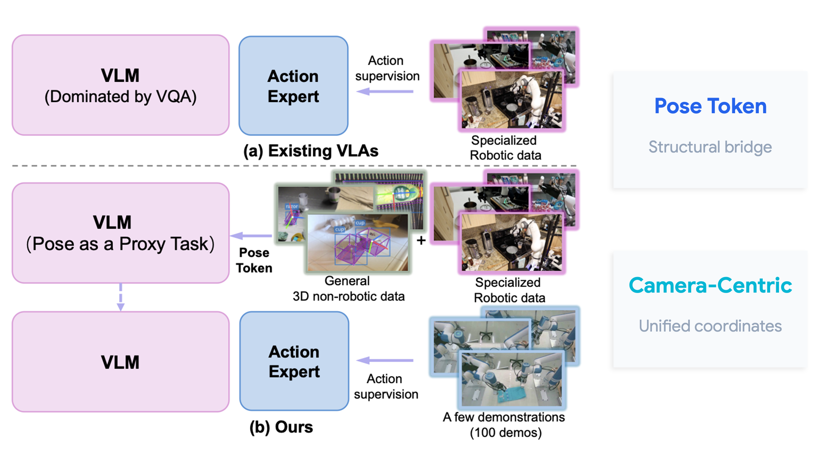

<div align="center">

# PoseVLA: Universal Pose Pretraining for Generalizable Vision-Language-Action Policies (RSS2026)

[//]: # (Purely HuggingFace + Accelerate + DeepSpeed + Hydra based — concise code, multi-node ready, easy to extend.)

[](https://arxiv.org/abs/2602.19710)
[](https://hetolin.github.io/PoseVLA/)
[](https://www.modelscope.ai/models/hanyangyu1021/PoseVLA-robotwin/files)

[\[🚀 Quick Start\]](#-quick-start) [\[🌟 Pre-train\]](docs/PRETRAIN.md) [\[🤖 Post-train (Robotwin)\]](docs/POSTTRAIN.md) [\[🕹 RoboTwin Eval\]](robotwin/PoseVLA/README.md) [\[🐛 Troubleshooting\]](docs/PRETRAIN.md#-troubleshooting)



</div>

---

## News 🚀🚀🚀
- `2026/06`: Initial release of **PoseVLA**: supports Omni3D / Omni6D / BOP / GraspClutter6D for 3D tasks and Agibot / InternData-A1 for robot actions.

---

## 🏆 Main Results on RoboTwin (50 tasks, Average %)

| Method                | Easy | Hard |
|:----------------------| :---: | :---: |
| π0                    | 67.00 | 65.12 |
| π0.5                  | 79.48 | 76.16 |
| PaliGemma_expert      | 35.40 | 33.36 |
| Pose-VLA (In Paper)   | 79.91 | 79.10 |
| **PoseVLA (In Repo)** | **89.40** | **88.60** |

---

## 📖 Documents

PoseVLA is split into two training stages, each with its own document:

| Stage | Entry script | Config | Doc |
| --- | --- | --- | --- |
| **Pre-train** (joint VLM + Action on large-scale data) | [train_pretrain.py](train_pretrain.py) | [config/base.yaml](config/base.yaml) | [docs/PRETRAIN.md](docs/PRETRAIN.md) |
| **Robotwin data conversion** (raw → HDF5 + normalization) | [utils/process_data_all.py](utils/process_data_all.py) | [config/dataset/robotwin.yaml](config/dataset/robotwin.yaml) | [docs/ROBOTWIN_DATA.md](docs/ROBOTWIN_DATA.md) |
| **Post-train / Fine-tune** (Robotwin and other downstream robots) | [train_posttrain.py](train_posttrain.py) | [config/base_posttrain.yaml](config/base_posttrain.yaml) | [docs/POSTTRAIN.md](docs/POSTTRAIN.md) |
| **RoboTwin simulation eval** | [robotwin/PoseVLA/eval_policy.py](robotwin/PoseVLA/eval_policy.py) | [robotwin/PoseVLA/deploy_policy.yml](robotwin/PoseVLA/deploy_policy.yml) | [robotwin/PoseVLA/README.md](robotwin/PoseVLA/README.md) |

The project supports three orthogonal training modes that can be freely combined:

- **VLM training** — learn 3D object detection via **Next-Token Prediction (NTP)** on Omni3D, Omni6D, BOP, GraspClutter6D, …
- **Action training** — learn robot actions via **Flow Matching** on HDF5 / LeRobot-format data (Agibot, InternData-A1, Robotwin, …).
- **Co-Training** — VLM and Action data are interleaved within the same optimization step.

### 📁 Project Structure

```
PoseVLA/
├── train_pretrain.py           # Pre-train entry (hydra + accelerate + deepspeed)
├── train_posttrain.py          # Post-train / fine-tune entry (Robotwin etc.)
├── eval_detection.py           # Evaluation / mAP entry (Omni3D and other 3D tasks)
│
├── posevla/                    # PoseVLA model implementation (π0 / π0.5 based)
│   ├── configuration_posevla.py    # PoseVLAConfig
│   ├── modeling_posevla.py         # PoseVLAPolicy (PaliGemma + Action Expert + Flow Matching)
│   ├── paligemma_with_expert.py    # PaliGemma + Expert dual-stream architecture
│   ├── patch_embed.py              # Vision patch embedding (SigLIP + prior fusion)
│   ├── convert_jax_model_to_pytorch.py  # JAX → PyTorch weight converter
│   └── _lerobot_compat.py         # LeRobot compatibility layer
│
├── data/
│   ├── factory.py              # Unified VLM / Action DataLoader factory
│   ├── collators.py            # DataCollators (action / detection)
│   ├── ds_raw/                 # Raw dataset readers
│   │   ├── agibot.py / interndata_a1.py / robotwin.py
│   │   ├── droid.py / rdt.py / umi.py / xtrainer.py
│   │   └── mix.py             # Multi-source mixed dataset reader
│   └── ds_train/               # Training Datasets
│       ├── detection/          # 3D detection datasets (VLM)
│       │   ├── dataset_bop.py / dataset_omni3d.py / dataset_omni6d.py
│       │   ├── dataset_clutter.py
│       │   └── graspclutter6dAPI.py
│       └── robot/              # Robot action datasets (VLA)
│           ├── dataset_hdf5_action.py   # HDF5 action dataset
│           ├── dataset_lerobot.py       # LeRobot format dataset
│           └── dataset_agibot.py        # Agibot dataset
│
├── utils/                      # Shared utilities
│   ├── process_data_all.py     # Robotwin raw → HDF5 conversion
│   ├── mapping_token.py        # Text ↔ 3D scene encoding / decoding utilities
│   ├── transform_utils.py      # SE(3) / pose math helpers
│   ├── image_corrupt.py        # Image augmentation
│   ├── vis.py                  # Visualization helpers
│   └── logger.py               # WandB / training-state logging
│
├── config/                     # Hydra configs
│   ├── base.yaml               # Pre-train main config
│   ├── base_posttrain.yaml     # Post-train (Robotwin) main config
│   ├── zero0.json / zero2.json / zero3_offload.json   # DeepSpeed configs
│   ├── dataset/                # Action training dataset configs (hdf5, lerobot, robotwin)
│   ├── dataset_bop/            # BOP series
│   ├── dataset_clutter/        # GraspClutter6D
│   ├── dataset_omni6d/         # Omni6D
│   ├── dataset_omni3d/         # Omni3D (train/val/test)
│   ├── dataset_lerobot/        # LeRobot grouped configs
│   └── dataset_meta/           # Per-source sample lists (json)
│
├── scripts/
│   ├── launch/                 # Training launch scripts
│   │   ├── pretrain.sh         # Multi-GPU launch for pre-training (train_pretrain.py)
│   │   └── posttrain.sh        # Multi-GPU launch for post-training (train_posttrain.py)
│   ├── download/               # Dataset download / extract / yaml-gen scripts
│   │   ├── agibot.sh
│   │   ├── interndata_a1.sh
│   │   ├── interndata_a1_unzip.sh
│   │   └── interndata_a1_generate_yaml.py
│   └── stats/                  # Dataset normalization stats
│       ├── compute_dataset_stat_hdf5_abs_joint.py
│       ├── compute_dataset_stat_hdf5_rel_ee.py
│       ├── norm_robotwin.py    # Robotwin EEP / qpos normalization stats
│       └── normalize.py
│
├── bin_stats/                  # Non-uniform tokenizer bin boundaries
│   └── nonuniform_bins.pkl     # Pre-computed quantization bins for 3D tokenization
│
├── docs/                       # Stage-level documents
│   ├── PRETRAIN.md             # Pre-train guide
│   ├── POSTTRAIN.md            # Post-train / fine-tune guide (Robotwin)
│   └── ROBOTWIN_DATA.md        # Robotwin raw → HDF5 conversion guide
│
├── robotwin/PoseVLA/           # RoboTwin simulation deploy + eval
└── google/paligemma-3b-pt-224/ # Local PaliGemma tokenizer / config
```

---

## 🚀 Quick Start

### 1. Clone

```bash
git clone git@github.com:hetolin/PoseVLA.git
cd PoseVLA
```

### 2. Conda env (installation from scratch)

- Python 3.10.12
- PyTorch 2.7.0 + CUDA 12.6 (TF32 / bf16 works best on Ampere / Hopper GPUs)

```bash
conda create -n vla python==3.10.12
conda activate vla

# Install PyTorch first — it is intentionally NOT pinned in requirements.txt,
# because the correct wheel depends on your local CUDA version.
# CUDA 12.6:
pip install torch==2.7.0 torchvision==0.22.0 torchaudio==2.7.0 \
    --index-url https://download.pytorch.org/whl/cu126

# Install lerobot (pinned commit, compatible with PoseVLA)
# Fix: rename `pyav` -> `av` (package renamed on PyPI)
# Fix: remove `rerun-sdk` (requires numpy>=2, conflicts with imgaug)
git clone https://github.com/huggingface/lerobot.git third_party/lerobot \
  && cd third_party/lerobot \
  && git checkout 638d411cd3acf32c28d8c2120f3c41bda8bb15d4 \
  && sed -i 's/pyav/av/' pyproject.toml \
  && sed -i '/rerun-sdk/d' pyproject.toml \
  && pip install -e . \
  && cd ../..

# (Optional) Install bop_toolkit (used for BOP dataset, for 3D pretraining only)
git clone https://github.com/thodan/bop_toolkit.git third_party/bop_toolkit \
  && cd third_party/bop_toolkit \
  && pip install -e . \
  && cd ../..

# NOTE: keep the `lerobot` line commented out in requirements.txt — we install it manually.
pip install -r requirements.txt

```

### 3. Pretrained weights

Create a `pretrain/` directory under the project root and place any of the following weights (pick what you need — multiple loading branches are available in [train_pretrain.py](train_pretrain.py)):

```
pretrain/
├── paligemma-3b-pt-224/   # Vanilla PaliGemma VLM
├── lerobot_pi0/           # π0
└── pi05_base/             # π0.5
```

The tokenizer is already bundled under [google/paligemma-3b-pt-224/](google/paligemma-3b-pt-224/); the config points to it via `model.tokenizer_model_path`.

### 4. Environment variables

Set the project parent directory before launching Hydra-based training scripts. At minimum:

```bash
export ROOT="/your/home"
export DEV_PATH="${ROOT}/robot_code"
export PYTHONPATH="$PYTHONPATH:${DEV_PATH}"
export HF_HOME=${ROOT}/.cache/huggingface
export HF_LEROBOT_HOME=${HF_HOME}/lerobot
export HYDRA_FULL_ERROR=1
```

W&B auto-login: the script writes `/root/.netrc` — replace `API_KEY` with your own.

### 5. Next step

- For **pre-training** the PoseVLA backbone on large-scale 3D + action data, follow [docs/PRETRAIN.md](docs/PRETRAIN.md).
- For **post-training / fine-tuning** on RoboTwin (or your own robot), follow [docs/POSTTRAIN.md](docs/POSTTRAIN.md).
- For **simulation evaluation** on RoboTwin, follow [robotwin/PoseVLA/README.md](robotwin/PoseVLA/README.md).

---

## TODO List

- [x] Release the training / co-training code for PoseVLA.
- [x] Release the 3D evaluation entry (`eval_detection.py`) with mAP / PR-curve aggregation.
- [x] Release support for both **π0** and **π0.5** Action Experts in a single codebase (switchable via `training.pi05`).
- [x] Release the Robotwin post-training entry (`train_posttrain.py`) and RoboTwin deployment scripts.
- [x] Release pretrained PoseVLA checkpoints.

## 🙋 FAQs

If you encounter any issues, feel free to open an issue on GitHub or reach out through discussions. Feedback and contributions are very welcome! 🚀

## Acknowledgement

PoseVLA is built with reference to the following projects:
[lerobot](https://github.com/huggingface/lerobot),
[Transformers](https://github.com/huggingface/transformers),
[Google PaliGemma](https://huggingface.co/google/paligemma-3b-pt-224),
[π0 / OpenPI](https://github.com/Physical-Intelligence/openpi),
[Omni3D](https://github.com/facebookresearch/omni3d),
[BOP Toolkit](https://github.com/thodan/bop_toolkit),
and [GraspClutter6D](https://github.com/SeungBack/GraspClutter6D).
Thanks for their awesome work.